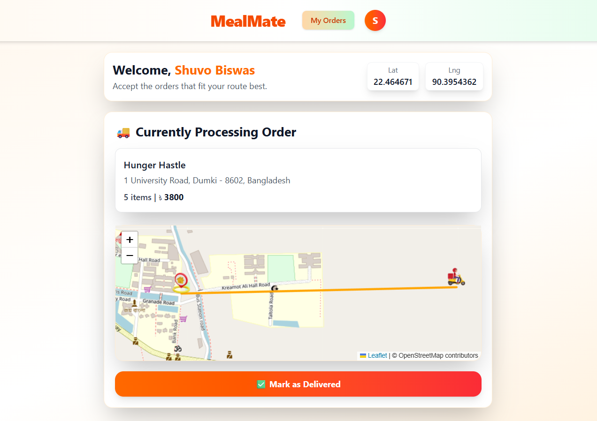

# 🍽️ MealMate – Food Delivery Full Stack App

MealMate is a real-time food delivery platform with three dashboards:
**User (Customer)** | **Shop Owner** | **Delivery Boy**.
It includes live order tracking, geolocation, delivery broadcast system, and an order management dashboard.

---

## 🚀 Features

### 👤 User Features
-  Browse shops & food items by category
-  Advanced search by food name or shop
-  Add to cart with quantity management
-  Place orders with multiple payment options:
  -  Cash on Delivery (COD)
  -  Online payment via **SSLCommerz** (card, mobile banking, internet banking)
-  Live order status updates via real-time notifications
-  Live delivery boy location tracking on interactive **Leaflet map**
-  OTP verification for secure order delivery handover
-  Complete order history with details
-  Rate and review food items
-  User profile management

### 🏪 Shop Owner Features
-  Create and manage shop profile
-  Add, edit, delete menu items with images & pricing
-  View and manage incoming orders
-  Update order status in real-time:
  - `pending` ➝ `preparing` ➝ `out_for_delivery` ➝ `delivered`
-  Broadcast delivery request to nearby delivery boys (within 5km radius using geospatial queries)
-  Track shop revenue and order statistics
-  Manage shop categories and item availability

### 🛵 Delivery Boy Features
-  Receive delivery broadcast notifications within 5km proximity
-  Accept order with exclusive locking mechanism (one order at a time)
-  View customer delivery location on interactive map
-  Real-time location sharing to customer (live GPS tracking)
-  Update delivery status with progress tracking
-  OTP-based secure delivery confirmation
-  Delivery history and earnings tracker
-  Availability toggle (online/offline status)

### 🔐 Authentication & Security
- JWT-based authentication with 7-day token expiry
- OTP verification for:
  - User signup
  - Delivery handover confirmation
- Role-based access control (User, Shop Owner, Delivery Boy)
- Secure password hashing

### 🌐 Real-time Features (Socket.IO)
- Live order status push notifications
- Delivery boy assignment broadcasts
- Real-time location streaming (delivery boy ↔ customer)
- Instant order acceptance notifications
- Live order updates to shop owners

### 📍 Geospatial Features (MongoDB 2dsphere)
- 5km proximity-based delivery boy matching
- Nearby shop discovery
- Shop radius filtering for service areas
- Real-time GPS coordinate tracking
- Distance calculation for delivery assignment

### 💳 Payment Integration (SSLCommerz)
- Secure online payment processing
- Multiple payment methods support:
  - Credit/Debit cards (Visa, Mastercard, Amex)
  - Mobile banking (bKash, Nagad, Rocket)
  - Internet banking
- Automatic order state transitions on payment success/failure
- Payment validation and callback handling
- Transaction tracking and history

---


## 🛠️ Tech Stack

| Category   | Technology Used |
|-------------|------------------|
| Frontend    | React, Tailwind CSS, React Router, Leaflet |
| Backend     | Node.js, Express.js (REST API) |
| Database    | MongoDB + 2dsphere Geo Index |
| State Mgmt  | Redux Toolkit (optional) |
| Realtime    | Socket.io(Use in future) |
| Auth        | JWT-based authentication |
| Location    | Browser Geolocation API |

---

## 📸 Screenshots

### ✅ Authentication Screens
| Login | Signup |
|-------|--------|
|  |  |

### ✅ User Screens
| User Dashboard | Cart | Place Order |
|----------------|------|--------------|
|  |  |  |

### ✅ Owner Screens
| Owner Dashboard | Orders |
|-----------------|--------|
|  |  |

### ✅ Delivery Boy Screens
| Delivery Boy Dashboard | Live Tracking |
|-------------------------|---------------|
|  |  |


---

## ⚙️ Installation and Setup (Local)

Follow the steps below to run this project on your local machine.

---

### ✅ Prerequisites
Make sure you have installed:
- **Node.js** (v16 or above)
- **npm** 
- **MongoDB** (Local or MongoDB Atlas)
- **Git**

---

### 📥 Clone Repository
```bash
git clone https://github.com/yourusername/mealmate.git
cd mealmate
```
### 🔧 Backend Setup
```bash
cd backend
npm install
```

### Start the backend server:
```bash
npm run dev
```

### 🎨 Frontend Setup

Open a new terminal:
```bash
cd frontend
npm install
npm run dev
```


### The frontend will start at:

http://localhost:5173

