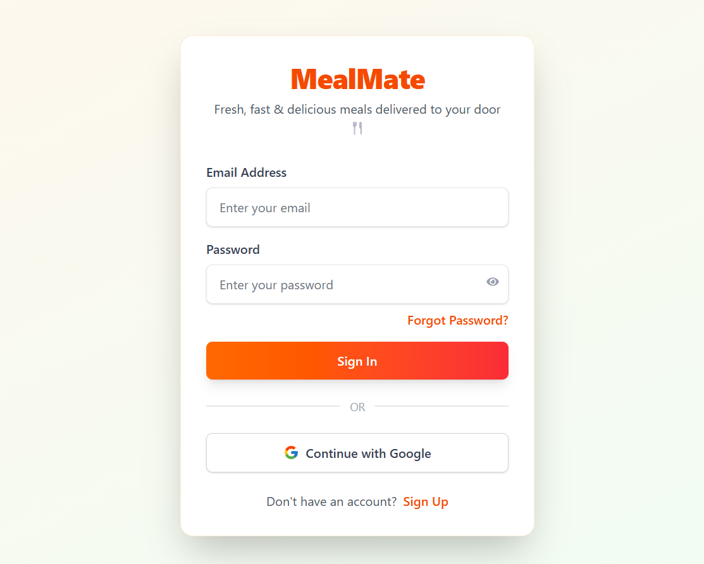
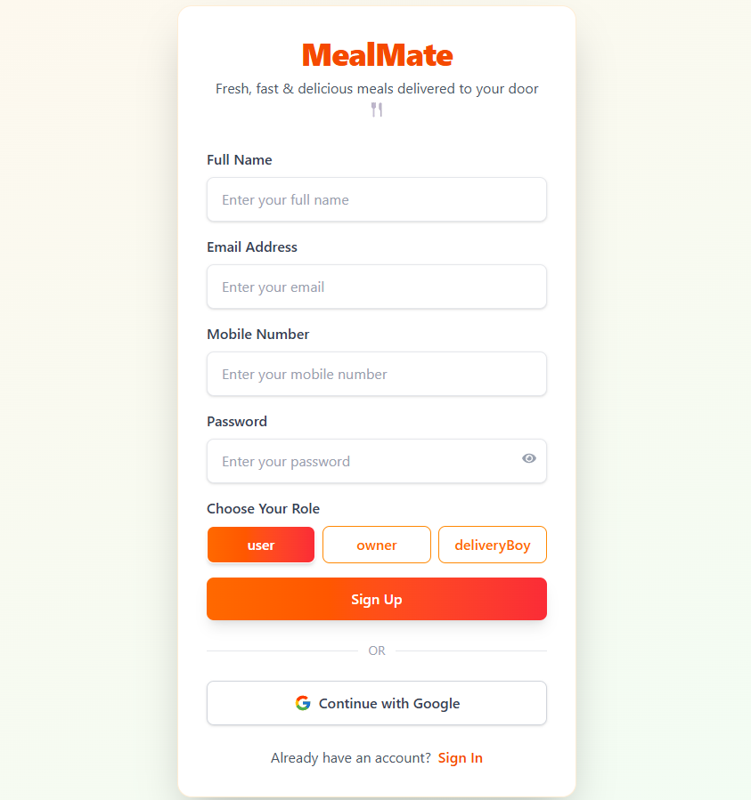
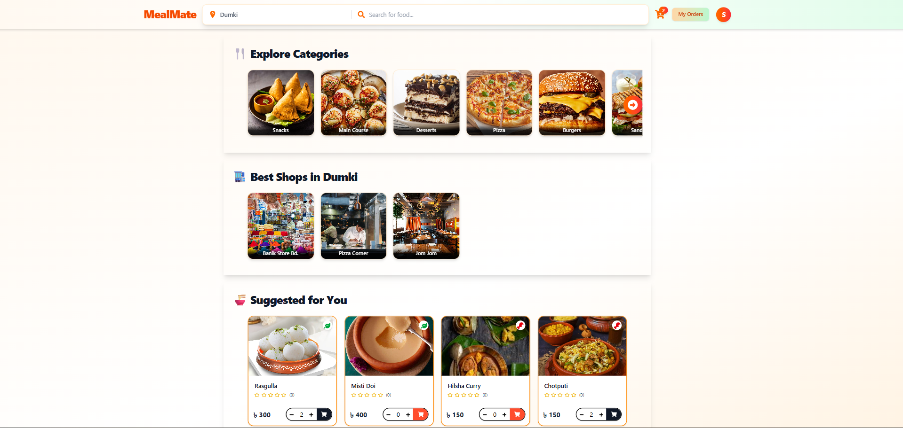
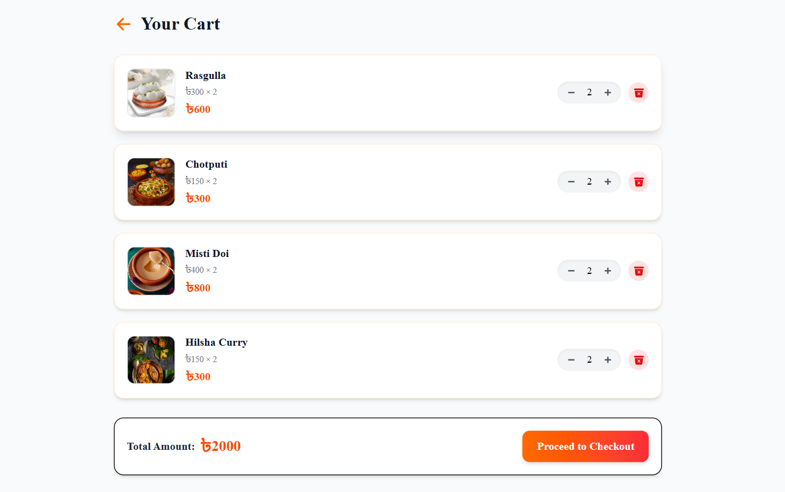
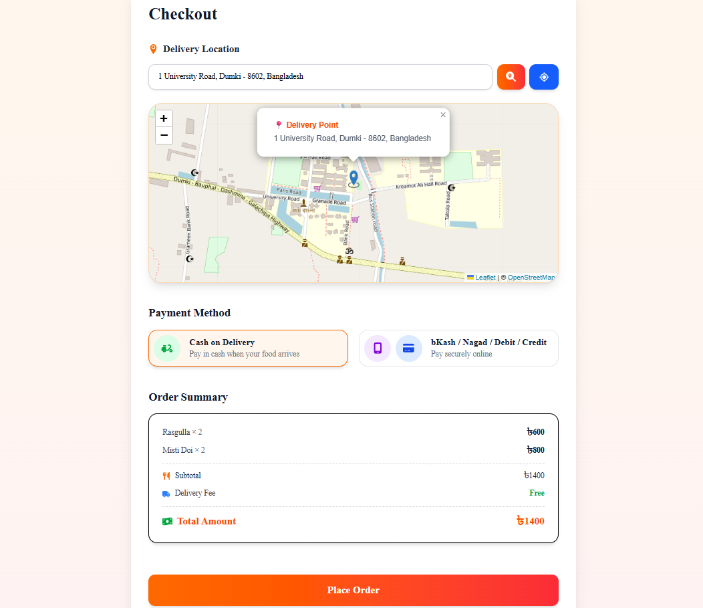
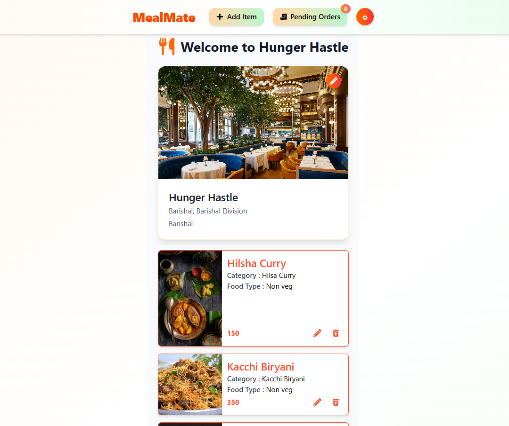
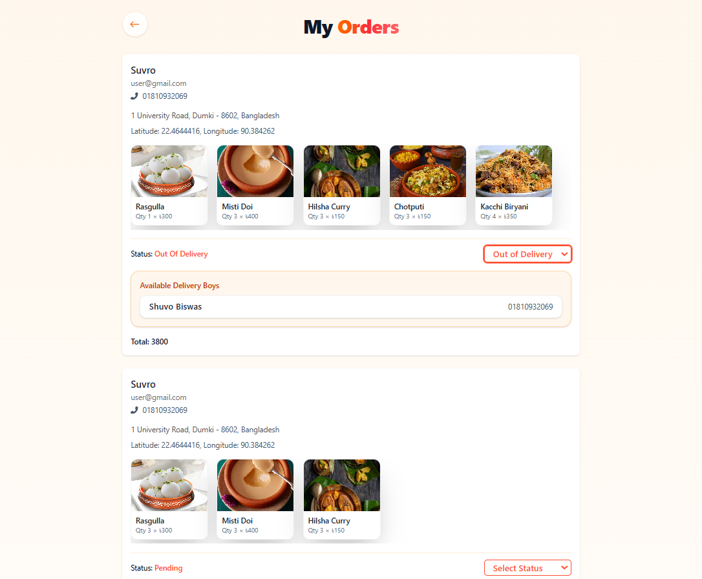
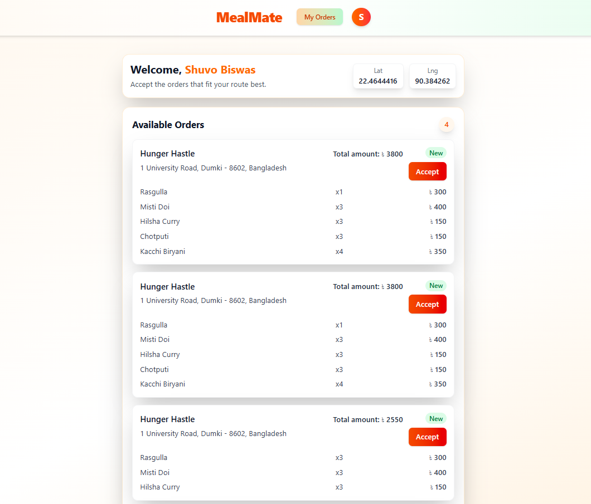

# 🍽️ MealMate – Food Delivery Full Stack App

MealMate is a real-time food delivery platform with three dashboards:
**User (Customer)** | **Shop Owner** | **Delivery Boy**.
It includes live order tracking, geolocation, delivery broadcast system, and an order management dashboard.

---

## 🚀 Features

### ✅ User Features
- Browse shops & food items
- Search by food or shop
- Add to cart
- Place orders (Cash on Delivery or Card)
- Live order status updates
- Live delivery boy location tracking (Leaflet map)
- Order history
- Cancel orders
- Rate and review food

### 🏪 Shop Owner Features
- Create shop
- Add, edit, delete items
- Manage orders
- Update order status (pending ➝ preparing ➝ out_for_delivery ➝ delivered)
- Broadcast delivery request to nearby delivery boys (within 5km)

### 🛵 Delivery Boy Features
- Receive delivery broadcasts within 5km
- Accept order (locking mechanism – one order at a time)
- See destination on map
- Live location sharing to user
- Update delivery status

---

## 🛠️ Tech Stack

| Category   | Technology Used |
|-------------|------------------|
| Frontend    | React, Tailwind CSS, React Router, Leaflet |
| Backend     | Node.js, Express.js (REST API) |
| Database    | MongoDB + 2dsphere Geo Index |
| State Mgmt  | Redux Toolkit (optional) |
| Realtime    | Socket.io |
| Auth        | JWT-based authentication |
| Location    | Browser Geolocation API |
| Payment     | [Optional: Stripe Integration] |

---

## 📸 Screenshots

### ✅ Authentication Screens
| Login | Signup |
|-------|--------|
|  |  |

### ✅ User Screens
| User Dashboard | Cart | Place Order |
|----------------|------|--------------|
|  |  |  |

### ✅ Owner Screens
| Owner Dashboard | Orders |
|-----------------|--------|
|  |  |

### ✅ Delivery Boy Screens
| Delivery Boy Dashboard |
|------------------------|
|  |

---

## ⚙️ Installation and Setup (Local)

Follow the steps below to run this project on your local machine.

---

### ✅ Prerequisites
Make sure you have installed:
- **Node.js** (v16 or above)
- **npm** 
- **MongoDB** (Local or MongoDB Atlas)
- **Git**

---

### 📥 Clone Repository
```bash
git clone https://github.com/yourusername/mealmate.git
cd mealmate
```
### 🔧 Backend Setup
```bash
cd backend
npm install
```

### Start the backend server:
```bash
npm run dev
```

### 🎨 Frontend Setup

Open a new terminal:
```bash
cd frontend
npm install
npm run dev
```


### The frontend will start at:

http://localhost:5173

